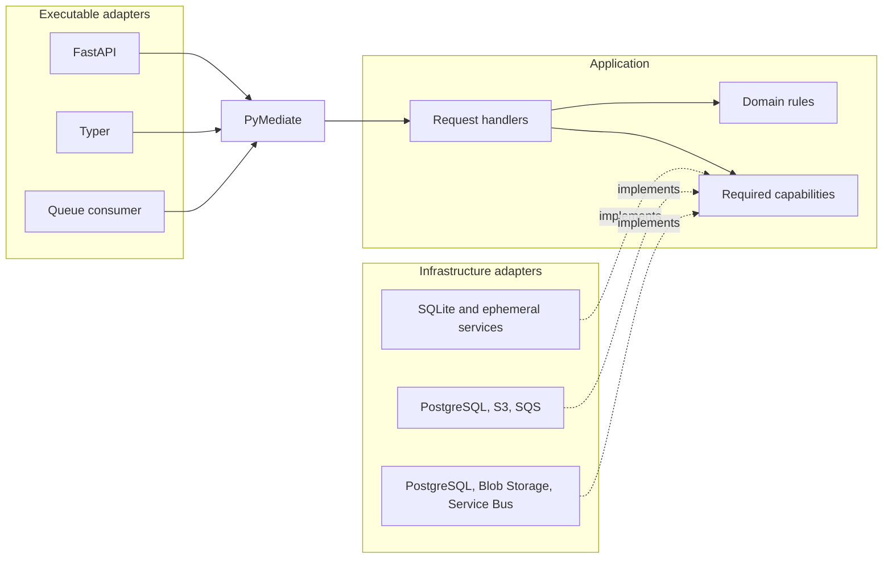

# Hexagonal architecture example: Shop

[](https://codespaces.new/sina-al/pymediate?devcontainer_path=.devcontainer%2F100-hexagonal-architecture%2Fdevcontainer.json)

This is PyMediate's deliberately extensive reference example. It implements the Shop domain from
[*Nobody wants to touch that code*](https://pymediate.sina-al.uk/articles/nobody-wants-to-touch-that-code)
as a uv workspace with several executable entry points and replaceable infrastructure profiles.

The example shows how small request handlers can remain unchanged while an application grows from
HTTP requests to a CLI, background workers, PostgreSQL, two queue providers, object storage,
transactional messaging, PDF reports, and distributed telemetry.

It is not a recommended starting structure. Most applications should begin with one package and a
small container. Package boundaries, a transactional outbox, cloud-specific adapters, and
data-driven composition are useful only when deployment boundaries or failure modes justify them.
The smaller examples in the [example index](../README.md) introduce PyMediate first.

## Prerequisites

- Python 3.12 or later;
- [uv](https://docs.astral.sh/uv/);
- native Pango libraries when rendering PDFs outside the supplied devcontainer or Docker image;
- Docker only for AWS-compatible, Azure-compatible, or Testcontainers checks.

Unlike the smaller examples, this workspace maps `pymediate` to the current repository checkout
through a repo-relative uv source. The release runner removes that override from its temporary copy
before it pins a wheel or index version. Docker builds use the repository root as their context so
the same local source is available during image construction.

## Five-minute demonstration

The default profile uses SQLite and process-local substitutes. Run the complete journey in one
process so every local component shares the same state:

```bash
cd examples/100-hexagonal-architecture
uv sync --extra default --extra worker
uv run poe demo
```

The scenario opens a customer, places an order, relays and consumes its outbox messages, creates an
invoice, sends an order confirmation, exports the customer's orders, emails the export link, and
queries the audit history.

The process boundary matters. A new `shop` or `shop-worker` invocation creates a new default SQLite
database and a new ephemeral broker. Separate commands do not form one persistent local workflow.
Use `poe demo`, one application test, a long-running API process, or a cloud-compatible profile when
state must survive across commands.

Run the API against one long-lived default process:

```bash
uv sync --extra default --extra openapi
uv run uvicorn shop.openapi.web:create_app --factory
```

Swagger UI is available at <http://localhost:8000/docs>.

## Ten-minute code tour

The ordinary application path can be read without first understanding the worker or cloud setup.

1. [`CreateOrderHandler`](packages/shop-application/src/shop/application/orders/create_order.py)
   coordinates one operation and returns an explicit response.
2. The [order ports](packages/shop-ports/src/shop/ports/orders/create_order.py) name only the
   capabilities that operation needs.
3. The [order entity](packages/shop-domain/src/shop/domain/entities/orders.py) owns state
   transitions and invariants.
4. The [FastAPI routes](packages/shop-adapter-openapi/src/shop/openapi/routes/orders.py) and
   [Typer commands](packages/shop-adapter-cli/src/shop/cli/commands/orders.py) translate their input
   into the same application requests.
5. The [application container](packages/shop-application/src/shop/application/container.py)
   composes feature containers and registers their handlers with one mediator.
6. The [ephemeral adapter](packages/shop-adapter-ephemeral/src/shop/adapters/ephemeral/) implements
   the required protocols for the default profile.
7. Continue with [background processing](docs/background-processing.md) for the durable path,
   [audit journal](docs/audit-journal.md) for business history, or
   [third-party abstractions](docs/third-party-abstractions.md) for the OpenTelemetry boundary.

## Domain map

The example retains the article's related capabilities instead of reducing the domain to one
anemic order record.

| Capability | Application operation | Relevant boundary |
| --- | --- | --- |
| Open and close accounts | `OpenCustomerAccountRequest`, `CloseCustomerAccountRequest` | Customers query orders through a narrow open-orders port. |
| Store credit | `AdjustStoreCreditRequest` | Immutable customer rule and explicit transaction. |
| Place an order | `CreateOrderRequest` | Catalogue, inventory, payment, journal, and transactional outbox. |
| Cancel or refund | `CancelOrderRequest`, `RefundOrderRequest` | Order state rules plus synchronous external collaborators. |
| Create invoices | `CreateInvoiceRequest` | Outbox message consumed through the same mediator. |
| Monthly statements | `CreateMonthlyStatementRequest` | Exchange rates, document rendering, and storage. |
| Export order history | `RequestOrderExportRequest`, `ExportOrdersRequest` | Durable queue work, streamed storage, and an emailed link. |
| Query order history | `GetOrderHistoryRequest` | Allowlisted projection of versioned audit events. |

The existing [`todo/restate-refund-workflow.md`](todo/restate-refund-workflow.md) describes a future
durable refund approval workflow. It is intentionally not implemented here.

## Component flow

FastAPI, Typer, and the queue consumer translate input into application requests. PyMediate selects
a handler. The handler applies domain rules and calls capabilities declared by protocols. The
selected deployment supplies implementations.



The application does not import FastAPI, Typer, Psycopg, boto3, or Azure SDKs. Another executable
adapter, such as a gRPC or MCP server, can translate its transport into the existing requests and
reuse the same mediator and handlers.

## Workspace packages

All distributions contribute to the shared PEP 420 `shop` namespace.

| Package | Kind | Responsibility |
| --- | --- | --- |
| [`shop-domain`](packages/shop-domain/) | Domain | Immutable entities, state rules, domain events, and structured errors. |
| [`shop-ports`](packages/shop-ports/) | Boundary contracts | Narrow runtime-checkable protocols and durable message values. |
| [`shop-application`](packages/shop-application/) | Application | Requests, responses, handlers, feature containers, behaviours, and services. |
| [`shop-bindings`](packages/shop-bindings/) | Composition | YAML validation, provider construction, role bindings, and resource lifecycle. |
| [`shop-adapter-cli`](packages/shop-adapter-cli/) | Primary adapter | Typer commands and Rich terminal output. |
| [`shop-adapter-openapi`](packages/shop-adapter-openapi/) | Primary adapter | FastAPI routes, Pydantic DTOs, OpenAPI, and Problem Details. |
| [`shop-adapter-worker`](packages/shop-adapter-worker/) | Primary adapter | Outbox relay, queue consumer, settlement, and message registry. |
| [`shop-adapter-common`](packages/shop-adapter-common/) | Secondary adapter | Stateless clock and exchange-rate defaults. |
| [`shop-adapter-ephemeral`](packages/shop-adapter-ephemeral/) | Secondary adapter | SQLite persistence plus process-memory catalogue and service substitutes. |
| [`shop-adapter-postgres`](packages/shop-adapter-postgres/) | Secondary adapter | Pooled persistence, transactions, journal, outbox, and inbox. |
| [`shop-adapter-aws`](packages/shop-adapter-aws/) | Secondary adapter | S3-compatible storage and SQS messaging. |
| [`shop-adapter-azure`](packages/shop-adapter-azure/) | Secondary adapter | Blob Storage and Service Bus messaging. |
| [`shop-adapter-weasyprint`](packages/shop-adapter-weasyprint/) | Secondary adapter | Bounded branded invoice and statement PDFs. |

Each package README describes its ownership, allowed dependency direction, public modules,
lifecycle, and focused tests.

## Application rules and responses

Requests and responses belong to one operation. A handler returns an explicit response rather than
a domain object, so an internal entity field does not automatically cross an HTTP, CLI, or queue
boundary.

Persistence protocols are also use-case-specific. One SQLite or PostgreSQL gateway implements
several protocols, but a refund handler can only see refund operations. Runtime-checkable protocols
let adapters declare and statically verify those implementations without coupling application code
to an infrastructure package.

Not every concrete implementation needs a separate adapter distribution. `StructlogLogger` lives
in `shop.application.services` because every profile currently uses it and it owns no external
resource. If deployments later require materially different logging implementations, the existing
logger protocol provides a seam for extracting them. Package placement follows actual variation
and lifecycle, not a rule that every concrete class must sit outside the application package.

Database-writing handlers show their transaction boundary directly:

```python
async with self._unit:
    order = await self._database.get_order(request.order_id)
    refunded = order.refund(request.amount_pence)
    await self._database.replace_order(refunded)
    await self._journal.append(
        OrderRefundedEvent(
            refunded.order_id,
            refunded.customer_id,
            request.amount_pence,
            refunded.refunded_pence,
            refunded.status.value,
        )
    )
```

There is no automatic transaction behaviour. A blanket behaviour could keep a database transaction
open while a handler waits for payment, mail, or object storage. The handler owns the scope because
it knows which local operations must be atomic.

## Reliability boundaries

The outbox path is designed for at-least-once delivery, concurrent relay/consumer processes, lease
recovery, and duplicate suppression:

```text
mediator -> local transaction -> outbox -> relay -> queue -> consumer -> mediator -> effect
```

Foreground inventory, payment, and cancellation mail calls are intentionally smaller synchronous
examples. A local database transaction cannot atomically include those remote systems. The code
orders common failure cases and performs in-process compensation where useful, but it does not
claim crash-safe distributed settlement for those calls. A durable workflow or saga is required
when that guarantee matters.

[Background processing](docs/background-processing.md) explains the stronger path, including lease
ownership, broker visibility, inbox deduplication, idempotency, and settlement ordering.

## Audit history

State-changing handlers append typed domain events in the same local transaction as current state.
The journal is internal audit evidence; entities are loaded from current-state tables, so the
application is not event sourced.

Domain events are not automatically turned into integration messages. The two records have
different consumers, identifiers, versions, and retention policies. The HTTP history endpoint
projects only allowlisted event versions instead of exposing arbitrary journal payloads.

See [Audit journal](docs/audit-journal.md) for the safety boundary and what an event does and does
not prove.

## Executable adapters

### FastAPI

Feature routers translate Pydantic DTOs to application requests and map explicit responses back to
DTOs. Known domain errors have individual RFC 9457 Problem Details handlers. A final safety handler
logs an unmapped domain error and returns no internal detail.

### Typer

The `shop` command groups operations under `orders`, `customers`, `invoices`, and `statements`.
Commands parse terminal input, send application requests, and render responses with Rich. In a
persistent cloud administration container, commands can form a multi-command workflow. The default
profile remains process-local.

### Worker

The worker distribution exposes independently deployable roles:

```bash
uv run shop-worker relay
uv run shop-worker consume
```

Both support `--once` for operational checks and tests. Relay requires no application container;
the consumer composes the application mediator because decoded messages become typed requests.

## Infrastructure profiles and composition

| Capability | Default | AWS-compatible | Azure-compatible |
| --- | --- | --- | --- |
| Database | SQLite | PostgreSQL | PostgreSQL |
| Queue | Process-local | SQS | Service Bus |
| Storage | Process-local | S3-compatible | Blob Storage |
| PDF rendering | WeasyPrint | WeasyPrint | WeasyPrint |
| Catalogue, inventory, payment, mail | Process-local | Process-local | Process-local |

The cloud profiles retain process-local implementations for capabilities that the example does not
assign to AWS- or Azure-owned systems.

`shop-bindings` reads `configuration/default.yaml`, `aws.yaml`, or `azure.yaml`. Definitions support
dotted `impl` paths, `$ref`, environment values, and `singleton`, `factory`, or `resource`
lifetimes. Application, relay, and consumer roles declare their own providers and process resources.
`configuration.schema.json` supplies hover descriptions, completion, and required-field diagnostics.

This YAML composition root intentionally demonstrates the upper end of Dependency Injector
composition. A smaller application can instantiate `ApplicationContainer` with concrete providers
or use normal provider overrides in a short Python module.

`SHOP_WIRING` selects the source file. Container images copy the selected profile to the unified
runtime path `/etc/shop/configuration.yaml`.

## Cloud-compatible environments

Every Compose task accepts the same required `--cloud aws|azure` flag. The tasks are direct command
definitions in `tasks.compose.toml`; there is no shell dispatcher. Poe can show the available tasks,
the arguments for one task, or the exact expanded command without running it:

```bash
uv run poe --help
uv run poe --help compose:logs
uv run poe --dry-run compose:up --cloud aws
```

The common lifecycle commands are:

```bash
uv run poe compose:up --cloud aws
uv run poe compose:logs --cloud aws
uv run poe compose:down --cloud aws

uv run poe compose:up --cloud azure
uv run poe compose:status --cloud azure
```

The base Compose file owns PostgreSQL, the OpenTelemetry Collector, API, relay, consumer, and
administration services. Cloud overrides add their emulator and host-specific images. Entrypoints
and commands stay in the base file; each image contains only its selected host and infrastructure
profile.

Open a wired administration shell with `uv run poe compose:shell --cloud aws` or
`uv run poe compose:shell --cloud azure`.

## Tests and checks

Tests live with the package whose boundary they exercise:

- domain tests call entities directly;
- application unit tests call handlers directly with autospecced protocols and no mediator;
- application integration tests send requests through the real mediator;
- host tests exercise CLI and HTTP translation;
- adapter tests cover persistence, settlement, and SDK mappings;
- opt-in Testcontainers tests cover PostgreSQL, SQS, and Service Bus integrations;
- acceptance tests exercise the complete local journey.

[Testing the Shop example](docs/testing.md) explains the purpose and failure modes covered by each
layer.

Run the flagship quality gate only:

```bash
uv run poe check
uv run poe compose:config --cloud aws
uv run poe compose:config --cloud azure
```

The configured 100% coverage gate applies to `shop.domain` and `shop.application`. Adapter and host
packages retain focused tests but are not included in that coverage percentage.

## Non-goals

This example does not provide authentication, authorization, a production product catalogue,
production payment or mail services, a durable refund approval workflow, infrastructure-as-code,
or an observability backend. Those choices are deployment- and product-specific and would obscure
the application boundaries being demonstrated.
