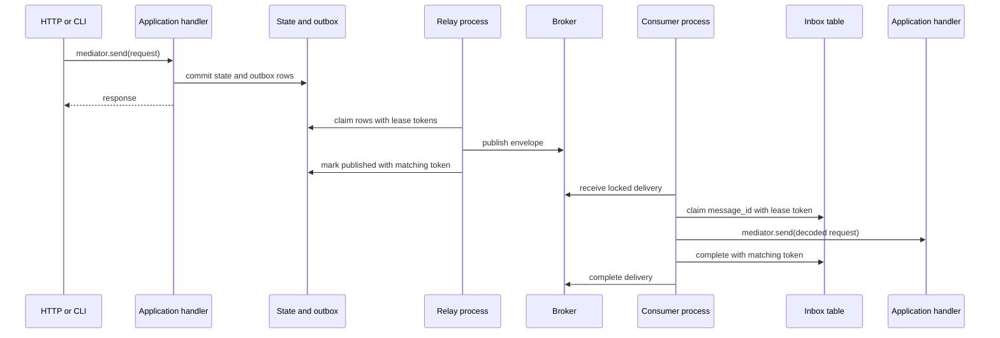

# Background processing

The worker handles work that must survive the process that accepted it. Ordinary in-process
mediator requests do not need the mechanisms in this guide.

If losing a task during restart is acceptable, an in-process task runner is smaller. If work must
survive crashes, scale across competing workers, and tolerate duplicate delivery, each boundary
below addresses a separate failure.

## Complete journey

Relay and consumer are separate `shop-worker` processes and containers. They share a distribution
because they share transport contracts and registry code, but they have separate DI containers and
can be scaled independently. Relay does not construct the application container. Consumer does,
because a decoded message becomes an ordinary application request.

## Guarantees

The design provides at-least-once message delivery. An observable external effect is effectively
once only when its handler also passes `message_id` as an idempotency key and the target adapter
suppresses a repeated key.

It does not claim a distributed exactly-once transaction across PostgreSQL, SQS or Service Bus,
object storage, mail, and the application database.

| Failure | Mechanism | Recovery |
| --- | --- | --- |
| State commits and the process stops before publication | Transactional outbox | A relay can claim the committed row later. |
| Broker accepts a publish and relay stops before marking it | Inbox plus idempotency | Republishing may duplicate delivery but not a completed effect. |
| Two relays or consumers race | Opaque lease token | Only the current owner can renew or settle the claim. |
| A worker stops while owning a claim | Expiring lease | Another worker receives a new token and reclaims it. |
| Work exceeds queue visibility | Broker and inbox renewal | Both ownership windows remain aligned during dispatch. |
| Effect succeeds before process stops | `message_id` idempotency key | Redelivery observes or recreates the same effect. |
| Inbox completes but broker acknowledgement fails | Inbox completion precedes acknowledgement | Redelivery sees `PROCESSED` and completes without dispatch. |
| Payload cannot be decoded or handled | Abandon and broker redrive policy | The delivery retries and eventually reaches its DLQ. |

## Four narrow boundaries

Messaging is split by responsibility instead of collected into one general queue interface.

### Integration contract

`shop.ports.integration` owns `IntegrationMessage`, its strict JSON codec, and the protocol
implemented by typed application contracts. An envelope contains exactly:

- application-generated UUID `message_id`;
- stable `event_type`;
- positive integer `schema_version`;
- aware UTC `occurred_at`;
- recursively JSON-compatible object `payload`.

Trace propagation is intentionally not part of that business contract.

### Outbox

`shop.ports.outbox` pairs the unchanged envelope with a W3C trace carrier. `OutboxWriter` is used
inside application transactions. `OutboxRelaySource` claims, renews, publishes, and releases
outbox work through `OutboxClaim(message, lease_token)`.

### Broker

`shop.ports.broker` owns publication and a locked `MessageDelivery`. A delivery can be completed,
abandoned, or renewed. SQS maps these to delete and visibility changes. Service Bus maps them to
peek-lock completion, abandonment, and lock renewal.

### Inbox

`shop.ports.inbox` owns database deduplication. A claim reports `PROCESS`, `PROCESSED`, or `BUSY`.
Only `PROCESS` carries a lease token. Renew, complete, and release operations succeed only while
that token still owns the row.

The separation keeps queue SDK concerns out of persistence, and it lets an application use the
audit journal without adopting a broker.

## Typed contracts and evolution

Application-owned integration contracts define their event type, version, and payload together:

| Contract | Version | Worker request |
| --- | --- | --- |
| `shop.orders.order-confirmation-requested` | 1 | `SendOrderConfirmationRequest` |
| `shop.invoices.invoice-requested` | 1 | `CreateInvoiceRequest` |
| `shop.orders.order-export-requested` | 1 | `ExportOrdersRequest` |

`IntegrationMessage.from_event()` accepts one self-describing contract. It does not accept an
unrelated event-name string and payload, and it does not accept a domain audit event.

The consumer treats broker bytes as untrusted. Its registry selects a decoder by
`(event_type, schema_version)`, validates a strict version-specific Pydantic payload, and only then
constructs a mediator request. Unknown names, unknown versions, missing fields, extra fields, and
wrong primitive types follow the normal retry and dead-letter path.

The worker's [registry tests](../packages/shop-adapter-worker/tests/unit/test_registry.py) include an
executable V1/V2 example. Both versions remain decodable while new producers move to V2; the
registry performs any compatibility translation before application code sees a request. The live
application does not carry an unused V2 contract merely to illustrate the technique.

## Transactional outbox

A use case writes business state, its audit fact, and any integration envelopes through the same
task-owned database transaction. All commit or all roll back.

The relay claims a bounded batch. Every claim carries an opaque token and expiry. Publication is
followed by a conditional `mark published`; the token prevents a slow relay from settling a row
whose expired lease has already been reclaimed.

The relay renews active batch claims while it publishes. Successfully marked rows are removed from
the renewal set. On failure it conditionally releases the remaining claims. Published rows retain
`published_at` for diagnostics instead of being deleted immediately.

No local transaction can atomically include the broker. A stop after broker acceptance but before
`published_at` remains a deliberate duplicate window.

## Consumer settlement

For a new delivery, the consumer:

1. claims `message_id` in the inbox;
2. attaches the persisted trace parent;
3. renews broker visibility and the inbox lease together;
4. decodes the envelope into a typed request;
5. sends it through the application mediator;
6. conditionally completes the inbox claim;
7. completes the broker delivery.

If renewal fails, processing is stopped, the delivery is not acknowledged, and the failure is
surfaced. Any effect that may have completed before cancellation must be idempotent because the
message can return.

An error before inbox completion conditionally releases the inbox claim and abandons the broker
delivery. Cleanup failures are logged without replacing the original handler or decoding error.

An error after inbox completion is different. If broker completion fails, the inbox row remains
`PROCESSED`. Releasing it would allow a second mediator dispatch. On redelivery the consumer sees
the completed row and attempts broker completion without running application code again.

## Implementations

| Profile | Publisher and consumer | Persistence |
| --- | --- | --- |
| Default | `EphemeralMessageBroker` | Shared in-process SQLite connection. |
| AWS-compatible | `SqsMessageBroker` | PostgreSQL pool. |
| Azure-compatible | `AzureServiceBusMessageBroker` | PostgreSQL pool. |

The ephemeral broker crosses the same strict serialization boundary as cloud adapters. Visibility
expiry increments delivery attempts, and the configured fifth failed attempt moves a message to
its process-local DLQ.

The default profile cannot connect separate processes: its queue and in-memory effects exist only
inside one Python process. `poe demo` and the acceptance journey run relay and consumer together.
Cloud profiles deploy them separately against durable infrastructure.

Queue thresholds are deployment policy. The example uses five attempts, two-minute visibility and
processing leases, and thirty-second renewal intervals. Production values should be based on
measured processing time, broker limits, and operational recovery procedures.

## Tests to read

- relay unit tests isolate lease renewal, stale settlement, publication failure, and the
  publish-before-mark window;
- consumer unit tests isolate inbox decisions, completion ordering, renewal loss, and
  acknowledgement failures;
- registry unit tests isolate malformed data and version compatibility;
- ephemeral adapter tests demonstrate visibility expiry and DLQ behavior;
- the root acceptance test follows confirmation, invoice, and export effects through both mediator
  dispatches;
- opt-in SQS and Service Bus tests cover renewal, redelivery, DLQ movement, and settlement against
  provider emulators.

See [Testing the Shop example](testing.md) for the complete test-layer map.
