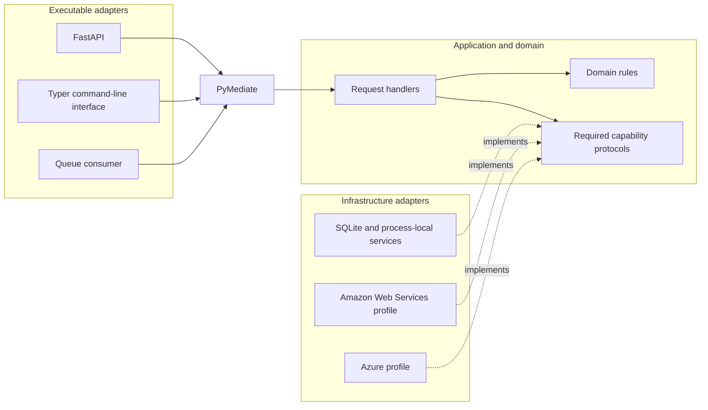

# 900-hexagonal-architecture

[](https://codespaces.new/sina-al/pymediate?devcontainer_path=.devcontainer%2F900-hexagonal-architecture%2Fdevcontainer.json)

Hexagonal architecture separates application and domain code from delivery and infrastructure
code. The application declares the capabilities it needs as ports; adapters implement those
ports for HTTP, command-line, database, queue, and storage technologies.

This flagship example combines the focused PyMediate topics in a Shop application. It assumes
you have read the earlier examples. It is a reference for boundaries and composition, not a
required starting structure for every application.

## Run

Run these commands from this example directory. The default profile uses SQLite and process-local
adapters. The supplied Codespace contains the native document-rendering libraries.

```bash
uv sync --extra default --extra worker
uv run poe demo
```

The command emits request logs followed by these deterministic summary lines:

```text
Shop demonstration complete
  customer: 7
  order: 1 (2400 pence)
  invoice: 1
  background messages: 3 published, 3 consumed
  export: memory://exports/7.csv
  mail messages: 2
```

The demonstration opens a customer account, places an order, relays and consumes outbox
messages, creates an invoice, exports the customer's orders, sends mail, and reads the results
in one process.

## Handler dependencies

An application handler coordinates one operation through narrow Python `Protocol` interfaces:

```python
class CreateOrderHandler(RequestHandler[CreateOrderRequest]):
    def __init__(
        self,
        catalogue: ProductCatalogue,
        unit: UnitOfWork,
        database: CreateOrderDbGateway,
        inventory: CreateOrderInventory,
        payments: CreateOrderPaymentGateway,
        journal: DomainEventJournal,
    ) -> None:
        ...

    async def __call__(self, request: CreateOrderRequest) -> CreateOrderResponse:
        products = [await self._catalogue.get_product(item.sku) for item in request.items]
        ...
```

The create-order port exposes only the database operations needed by that handler:

```python
class CreateOrderDbGateway(OutboxWriter, Protocol):
    async def next_order_identity(self) -> int: ...
    async def insert_order(self, order: Order) -> None: ...
```

FastAPI routes, Typer commands, and queue consumers translate their input into typed application
requests. The selected deployment profile supplies concrete port implementations. Application
handlers do not import FastAPI, Typer, Psycopg, boto3, or Azure client libraries.

## Read the code

Read the ordinary request path before the worker and cloud profiles:

| File | What to read |
| --- | --- |
| [`shop-application/.../create_order.py`](packages/shop-application/src/shop/application/orders/create_order.py) | Start here. `CreateOrderHandler` coordinates order placement and returns an explicit response. |
| [`shop-ports/.../create_order.py`](packages/shop-ports/src/shop/ports/orders/create_order.py) | See how each protocol exposes only the capabilities used by order creation. |
| [`shop-domain/.../orders.py`](packages/shop-domain/src/shop/domain/entities/orders.py) | Follow the state transitions and invariants owned by the `Order` entity. |
| [`shop-adapter-openapi/.../orders.py`](packages/shop-adapter-openapi/src/shop/openapi/routes/orders.py) | See a FastAPI route translate HTTP input into an application request. |
| [`shop-adapter-cli/.../orders.py`](packages/shop-adapter-cli/src/shop/cli/commands/orders.py) | Compare the Typer command that sends the same request from a terminal. |
| [`shop-application/.../container.py`](packages/shop-application/src/shop/application/container.py) | Follow feature-container composition and handler registration with the mediator. |
| [`configuration/default.yaml`](configuration/default.yaml) | Trace the default profile from application ports to local adapter implementations. |

Then choose the guide for the boundary you want to study:

- [Background processing](docs/background-processing.md) covers the outbox, relay, queue,
  consumer, inbox, and settlement sequence.
- [Audit journal](docs/audit-journal.md) covers business-history events and safe projection.
- [Testing](docs/testing.md) covers direct handler, mediator, adapter, and acceptance tests.
- [Third-party abstractions](docs/third-party-abstractions.md) covers the OpenTelemetry boundary.

## Details

### Prerequisites and process scope

Local use requires Python 3.12 or later, [uv](https://docs.astral.sh/uv/), and native Pango
libraries for document rendering. Docker is needed only for the cloud-compatible and
Testcontainers checks. The Codespace and project Docker image include Pango.

The feature containers rely on safe nested Dependency Injector composition introduced in
PyMediate 0.7.0, so the project declares `pymediate[di]>=0.7.0`. A repository checkout uses the
editable PyMediate source until that release is published; release validation replaces it with
the candidate wheel or index version.

The default database and broker are created for the current process. Separate `shop` or
`shop-worker` invocations do not share a complete local workflow. Use `poe demo`, an application
test, one long-running application programming interface (API) process, or a durable profile when
state must cross process boundaries.

### Run the API

Start one long-running default-profile API process:

```bash
uv sync --extra default --extra openapi
uv run uvicorn shop.openapi.web:create_app --factory
```

In another terminal, open a customer account:

```bash
curl -s -X POST http://127.0.0.1:8000/customers \
  -H 'content-type: application/json' \
  -d '{"customer_id":7}'
```

```json
{"customer_id":7,"store_credit_pence":0}
```

Interactive OpenAPI documentation is available at <http://127.0.0.1:8000/docs> while the server
is running.

### Component flow



### Application capabilities

| Capability | Request | Main boundary |
| --- | --- | --- |
| Open and close accounts | `OpenCustomerAccountRequest`, `CloseCustomerAccountRequest` | Customer persistence and open-order query. |
| Adjust store credit | `AdjustStoreCreditRequest` | Customer rules and a local transaction. |
| Place an order | `CreateOrderRequest` | Catalogue, inventory, payment, journal, and outbox. |
| Cancel or refund | `CancelOrderRequest`, `RefundOrderRequest` | Order rules and inline external calls. |
| Create invoices | `CreateInvoiceRequest` | An outbox message consumed through the mediator. |
| Create monthly statements | `CreateMonthlyStatementRequest` | Exchange rates, document rendering, and storage. |
| Export order history | `RequestOrderExportRequest`, `ExportOrdersRequest` | Durable queue work, streamed storage, and mail. |
| Query order history | `GetOrderHistoryRequest` | Allowlisted projection of versioned audit events. |

Requests return operation-specific response types rather than domain entities. An internal entity
field therefore does not automatically cross an HTTP, command-line, or queue boundary.

### Workspace packages

All distributions contribute modules to one `shop` namespace package by using Python's PEP 420
namespace-package mechanism.

| Package | Kind | Responsibility |
| --- | --- | --- |
| [`shop-domain`](packages/shop-domain/) | Domain | Entities, state rules, domain events, and structured errors. |
| [`shop-ports`](packages/shop-ports/) | Ports | Capability protocols and durable message values. |
| [`shop-application`](packages/shop-application/) | Application | Requests, responses, handlers, feature containers, pipeline behaviors, and services. |
| [`shop-bindings`](packages/shop-bindings/) | Composition | Configuration validation, provider construction, role bindings, and resource lifecycle. |
| [`shop-adapter-cli`](packages/shop-adapter-cli/) | Input adapter | Typer commands and terminal output. |
| [`shop-adapter-openapi`](packages/shop-adapter-openapi/) | Input adapter | FastAPI routes, Pydantic data-transfer objects, OpenAPI, and Problem Details. |
| [`shop-adapter-worker`](packages/shop-adapter-worker/) | Input adapter | Outbox relay, queue consumer, settlement, and message registry. |
| [`shop-adapter-common`](packages/shop-adapter-common/) | Output adapter | Clock and exchange-rate defaults. |
| [`shop-adapter-ephemeral`](packages/shop-adapter-ephemeral/) | Output adapter | SQLite persistence and process-local service implementations. |
| [`shop-adapter-postgres`](packages/shop-adapter-postgres/) | Output adapter | PostgreSQL persistence, transactions, journal, outbox, and inbox. |
| [`shop-adapter-aws`](packages/shop-adapter-aws/) | Output adapter | S3-compatible storage and Simple Queue Service messaging. |
| [`shop-adapter-azure`](packages/shop-adapter-azure/) | Output adapter | Blob Storage and Service Bus messaging. |
| [`shop-adapter-weasyprint`](packages/shop-adapter-weasyprint/) | Output adapter | Invoice and statement PDF documents. |

Each package README documents ownership, dependency direction, public modules, lifecycle, and
focused tests.

### Transactions, background work, and audit history

Database-writing handlers declare their transaction boundary directly. This avoids holding a
database transaction open while waiting for payment, mail, or object storage. The create-order
transaction writes current state, a typed audit event, and integration messages to an outbox.

The background path is:

```text
mediator -> local transaction -> outbox -> relay -> queue -> consumer -> mediator -> effect
```

It supports at-least-once delivery, concurrent relay and consumer processes, lease recovery, and
duplicate suppression. Inventory, payment, and cancellation-mail calls remain inline examples. A
local database transaction cannot include those remote systems; a durable workflow or saga is
needed when crash-safe distributed coordination is required.

The audit journal records typed domain events in the same local transaction as current state.
Entities are still loaded from current-state tables, so this application is not event sourced.
Domain events and integration messages remain separate records because they have different
consumers, identifiers, versions, and retention policies.

### Deployment profiles

| Capability | Default | Amazon Web Services compatible | Azure compatible |
| --- | --- | --- | --- |
| Database | SQLite | PostgreSQL | PostgreSQL |
| Queue | Process-local | Simple Queue Service | Service Bus |
| Storage | Process-local | S3-compatible | Blob Storage |
| Document rendering | WeasyPrint | WeasyPrint | WeasyPrint |
| Catalogue, inventory, payment, mail | Process-local | Process-local | Process-local |

`shop-bindings` loads `configuration/default.yaml`, `aws.yaml`, or `azure.yaml`. Application,
relay, and consumer roles declare their own providers and managed resources. The
[background-processing guide](docs/background-processing.md) and adapter package READMEs contain
the role and cloud-specific commands.

### Tests and checks

Tests stay with the package whose boundary they exercise. Domain and handler tests call objects
directly; application integration tests use a mediator; input-adapter tests check translation;
output-adapter tests check persistence and client-library mappings; acceptance tests run the local
journey.

Run `uv run poe check` for the flagship quality gate. It runs the tests and coverage gate, then
checks linting, formatting, and static types. The 100% coverage threshold applies to `shop.domain`
and `shop.application`; adapters retain focused tests outside that percentage.

### Scope

The example does not implement authentication, authorization, a production catalogue, production
payment or mail services, a durable refund approval workflow, infrastructure as code, or an
observability backend. Those concerns require product and deployment decisions outside this
example's teaching scope.

The [`todo/restate-refund-workflow.md`](todo/restate-refund-workflow.md) note records one possible
future durable refund workflow; it is not part of the runnable application.

## Where next

- Read [*Nobody wants to touch that code*](https://pymediate.sina-al.uk/articles/nobody-wants-to-touch-that-code)
  for the design progression that led to this Shop domain.
- Revisit the focused [examples index](../README.md) when one boundary needs a shorter reference.
- Use the package and topic guides linked above for background processing, audit history, testing,
  composition, and infrastructure details.
