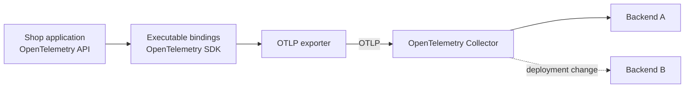
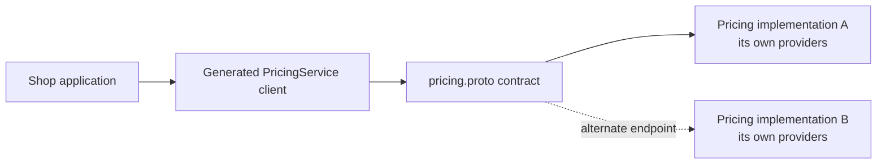

# Reusing third-party abstractions

The Shop application imports the OpenTelemetry API directly. It does not define a `TracerPort`,
`MetricsGateway`, or Shop-specific interface that repeats spans, counters, histograms, and context
propagation.

An inward dependency does not require every imported type to have a
locally owned wrapper. The useful question is whether the dependency already provides the stable
boundary, implementation separation, and substitution mechanism the application needs.

## OpenTelemetry already separates API from implementation

OpenTelemetry defines distinct roles for its API, SDK, protocol, and Collector. Its
[component model](https://opentelemetry.io/docs/concepts/components/) describes the split:

| Part | Responsibility | Shop location |
| --- | --- | --- |
| API | Types and operations used to create and correlate telemetry | `shop-application` |
| SDK | Implements the API, processes telemetry, and owns exporter configuration | `shop-bindings` |
| OpenTelemetry Protocol (OTLP) exporter | Encodes telemetry and sends it out of the process | `shop-bindings` |
| Collector | Receives, processes, and exports telemetry outside the application | Compose deployment |
| Backend | Stores, queries, and visualizes telemetry | Deployment choice |

The OpenTelemetry [client design principles](https://opentelemetry.io/docs/specs/otel/library-guidelines/)
require the API and SDK to be independent artifacts. Instrumented libraries depend only on the API;
the final application owner decides whether to install an SDK, how to configure it, and whether to
emit telemetry at all. The official
[Python instrumentation guidance](https://opentelemetry.io/docs/languages/python/instrumentation/)
makes the same recommendation: library-style instrumentation installs the API only, while the
executable application initializes the SDK.

Shop follows that model:

- `shop.application.behaviours.tracing` depends on the API's `Tracer` and span types;
- `shop.application.behaviours.metrics` depends on the API's `Meter` and instruments;
- `shop.application.outbox_messages` uses the API's propagation functions;
- `shop.bindings.opentelemetry` optionally installs the SDK providers and maintained OTLP
  exporters for an executable process;
- the default profile configures no SDK providers, so the API supplies valid no-op behavior;
- tests that need observable output use the SDK's in-memory facilities rather than a Shop fake.



The application names and describes its operations, but it does not construct an exporter or know
which observability backend receives the data.

## Why another telemetry interface would add little here

A local abstraction is useful when it expresses a boundary better than the dependency beneath it.
For example, an `OrderOutcomeRecorder` with `placed()` and `rejected()` could represent a narrow
business concept. Its implementation might use OpenTelemetry today and something else later. The
application would be claiming ownership of order-outcome semantics, not trying to redesign tracing.

A generic interface such as this makes a much larger claim:

```python
class TracerPort(Protocol):
    def start_span(self, name: str, attributes: Mapping[str, object]) -> Span: ...
```

It claims that Shop can provide a tracing abstraction with broader reach or better stability than
OpenTelemetry itself. To make that true, Shop would need to:

- define and version span, metric, context, status, error, and lifecycle semantics;
- map those semantics coherently to OpenTelemetry and every alternative implementation;
- preserve distributed context propagation across HTTP, queues, and background work;
- decide how semantic conventions, sampling, batching, exemplars, and asynchronous instruments
  appear through the smaller interface;
- maintain test implementations and compatibility as the underlying systems evolve;
- prevent the abstraction from becoming either a lowest-common-denominator API or a leaky copy of
  OpenTelemetry.

That is possible, but difficult. A wrapper that exposes `start_span()`, `create_counter()`, and
`record_histogram()` under different names has not reduced coupling. It has added a translation
layer and transferred maintenance responsibility to the application.

Using OpenTelemetry directly also keeps Shop compatible with its instrumentation ecosystem.
FastAPI, HTTP clients, database libraries, and other maintained instrumentations can contribute to
the same trace without being taught about a Shop-specific interface.

## What the Collector moves out of the application

The [OpenTelemetry Collector](https://opentelemetry.io/docs/collector/) is a vendor-neutral process
that receives, processes, and exports telemetry. OpenTelemetry recommends running one alongside
services in production so it can handle work such as batching, retries, encryption, and sensitive
data filtering outside the application process.

Shop processes send traces and metrics to the Collector using OTLP. The
[OTLP specification](https://opentelemetry.io/docs/specs/otlp/) defines the telemetry encoding and
its gRPC and HTTP transports. The application therefore targets a standard protocol and a local
Collector endpoint rather than a vendor SDK or vendor ingestion endpoint.

The example's `docker/opentelemetry/collector.yaml` configures:

- OTLP gRPC and HTTP receivers;
- a memory limiter and batch processor;
- separate trace and metric pipelines;
- a debug exporter for locally visible output;
- a health-check extension and bounded Collector resources.

Changing the debug exporter to a production backend is a deployment change. The Collector's
[receiver, processor, and exporter components](https://opentelemetry.io/docs/collector/components/)
can route, filter, enrich, sample, or send telemetry to multiple destinations without changing `LoggerBehavior`,
`TracingBehavior`, `MetricsBehavior`, or any use case.

The Collector does not replace the SDK. The in-process path is still:

```text
OpenTelemetry API call -> SDK provider -> processor/exporter -> OTLP -> Collector
```

The SDK turns API calls into exportable telemetry and manages in-process concerns. The Collector
owns the next operational stage. Standard `OTEL_*` variables select service identity, SDK behavior,
and the Collector endpoint; backend credentials and backend-specific pipelines can remain outside
the Shop application.

## The same reasoning applies to other APIs

The choice is not “third-party dependency or abstraction.” A third-party or shared contract may
already be the abstraction.

Consider a remote pricing capability defined as a gRPC remote-procedure-call service. gRPC uses Protocol Buffers as an
interface-definition language and generates client and server code from the service definition, as
described in the official [gRPC introduction](https://grpc.io/docs/what-is-grpc/introduction/).
The application can depend on that organization-owned service contract directly:



Multiple services can implement the same proto contract while choosing their own language,
database, cloud services, and internal adapters. The caller selects
an endpoint and depends on the network contract, not those internal providers. The abstraction has
moved to the network edge; it has not disappeared.

This can be cleaner than copying every generated method and message into a Python protocol and
a second set of DTOs. It remains an explicit coupling: the application accepts the proto's
versioning rules and gRPC's deadlines, status codes, and failure model.

A local gateway remains worthwhile when the application needs to:

- translate generated transport messages into a more stable business vocabulary;
- combine several remote calls into one capability;
- centralize deadline, retry, authentication, or status-code policy;
- support meaningful non-gRPC implementations;
- prevent generated types from spreading through business logic.

The decision follows the same test as OpenTelemetry: add a boundary when it owns useful semantics
or enables a real substitution. Do not add one solely because the current API is maintained by
someone else.

## A practical test before adding a port

Before wrapping an established API, ask:

1. Does it already separate a stable API from configurable implementations?
2. Is the application's actual variation already handled by plugins, providers, exporters, or a
   network contract?
3. Would the proposed interface express application vocabulary, or only rename third-party
   methods?
4. Which concrete alternative must the interface support, and where do its semantics differ?
5. Can deployment configuration or an external process move the variation out of application
   code?
6. Is the team prepared to own versioning, mappings, tests, documentation, and feature gaps for
   the new abstraction?

Depending directly on a third-party API can be the lower-coupling choice when that API is already
the maintained, implementation-neutral contract. Local ports remain valuable where the application
has a narrower concept to protect. The distinction is semantic ownership, not the location of the
package name.
